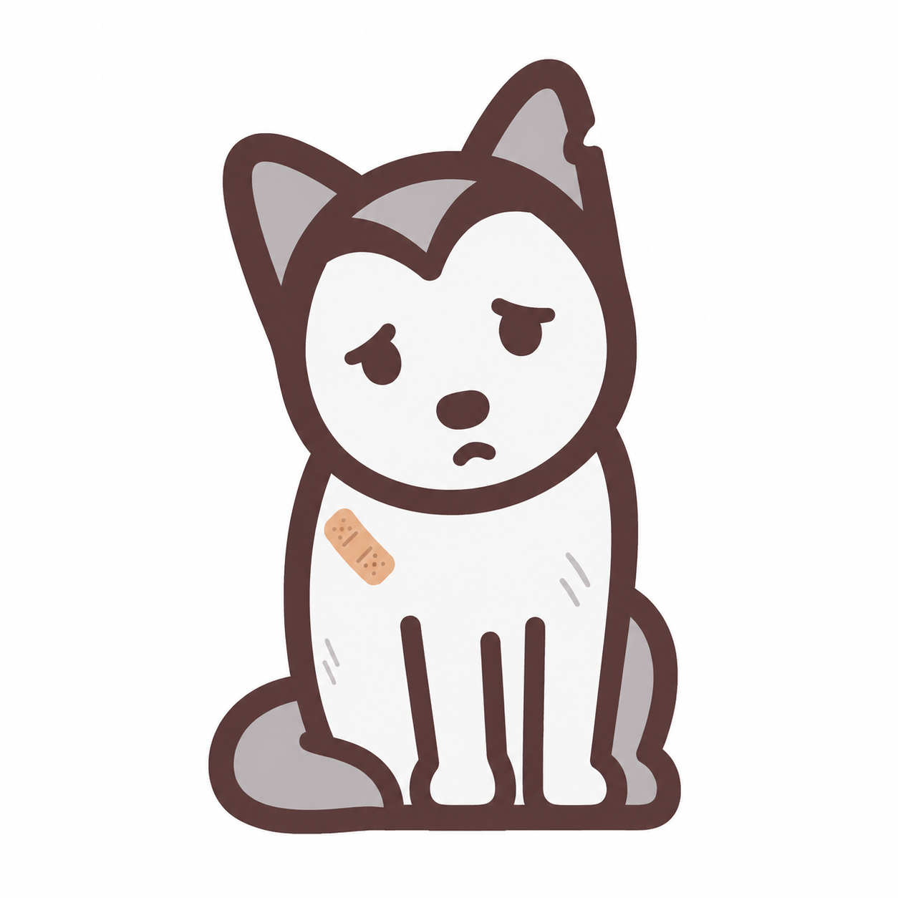

<p align="center">
  
</p>

<p align="center"><strong>Give stray animals a warm home</strong></p>

<p align="center">
  
  
  
  
  
  
</p>

[中文](README.md) | English

# Street Pet Society — Stray Animal Rescue Platform

A campus-focused stray animal rescue platform connecting animal lovers, volunteers, adopters, and campus administrators through technology. We provide comprehensive services for rescue, medical care, adoption, and donation.

## Features

| Module | Description |
|--------|-------------|
| 🏠 **Home** | Platform overview, latest animals, ways to help, contact info |
| 🔐 **Authentication** | Register, login, password reset, profile management |
| 🐾 **Animal Rescue** | Submit rescue requests, review applications, animal profiles |
| 🏡 **Adoption Center** | Browse adoptable animals, submit applications, manage adoptions |
| 📅 **Campus Activities** | Event publishing, registration, activity management |
| 💝 **Donations** | Browse donation projects, pledge supplies, track progress |
| 🤝 **Volunteer Community** | Articles, community posts, volunteer applications |
| 🔔 **Notifications** | In-site messages, auto mark-as-read |
| ⚙️ **Admin Dashboard** | SimpleUI admin, operational analytics, bulk user import |

## Quick Start

Requirements: Python 3.10+ and uv. Production uses MySQL 8.x and Redis 6+; local development defaults to SQLite.

```bash
# Install uv if needed
curl -LsSf https://astral.sh/uv/install.sh | sh

# Install Python and pin version
uv python install 3.10
uv python pin 3.10

# Install dependencies
uv sync --all-groups --locked

# Prepare configuration and database
cp .env.example .env
uv run python manage.py migrate

# Start the development server
uv run python manage.py runserver
```

Open <http://127.0.0.1:8000/>. Admin is available at <http://127.0.0.1:8000/admin/>.

## Development Commands

```bash
make format  # Fix and format Python and Markdown
make lint    # Ruff, mypy, mdformat, Django system checks
make test    # pytest
make check   # lint + test
```

## Tech Stack

- **Backend**: Django 4.2 + Celery + Redis
- **Database**: MySQL 8 (production) / SQLite (development)
- **Frontend**: Django templates + vanilla CSS/JS (warm orange theme)
- **Admin**: SimpleUI
- **Task Queue**: Celery + Redis
- **Code Quality**: Ruff, mypy, pytest

## Mission

> Every stray animal deserves to be treated with kindness. We believe technology can empower more people to participate in animal protection and change the fate of every small life with love and action.

## License

This project is available under the [MIT License](LICENSE).
