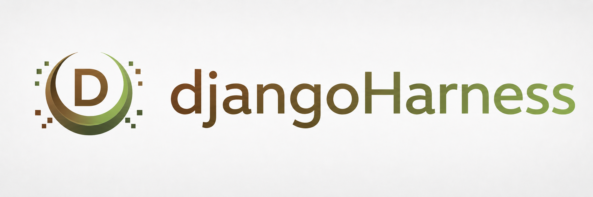

<p align="center">
  
</p>

<p align="center"><strong>Build consistent Django features with AI agents</strong></p>

<p align="center">
  
  
  
  
  
  
  
  
  
  
  
</p>

[中文](README.md) | English

# DjangoHarness

DjangoHarness can be simply understood as a framework built based on the Django framework and the harness engineering specification. Its original intention was to construct a base framework for AI and agents, enabling the rapid development of different business-related systems.

## Quick start

Requirements: Python 3.10+ and uv. Production uses MySQL 8.x and Redis 6+; local development defaults to SQLite, and Redis is only required when running a Celery worker.

```bash
# Install uv if needed
python -m pip install uv

# Install locked dependencies
uv sync --all-groups

# Prepare configuration and database
cp .env.example .env
uv run python manage.py migrate

# Start the development server
uv run python manage.py runserver
```

Open <http://127.0.0.1:8000/>. Django Admin is available at <http://127.0.0.1:8000/admin/>.

## Use the project Skill with Codex or Claude Code

The [`skill/`](skill/) directory packages the DjangoHarness agent rules as a complete project Skill. To use it with Codex or Claude Code:

1. Download or clone this repository.
1. Upload the complete `skill/` directory to the relevant project, conversation, or Skill import location in Codex or Claude Code.
1. Preserve the directory structure. Upload `SKILL.md`, `references/`, `agents/`, and `assets/` together instead of uploading only `SKILL.md`.
1. Ask the AI tool to load the DjangoHarness Skill before it creates or changes business code.

The Skill provides project structure, Django development, asynchronous task, database, and engineering quality rules. Skill import entry points may differ between tool versions; use the current interface provided by the relevant client.

## Development commands

```bash
make format  # Fix and format Python and Markdown
make lint    # Ruff, mypy, mdformat, and Django system checks
make test    # pytest
make check   # lint + test
```

## Documentation

- [Agent development rules](agent-docs/AGENTS.md)
- [Local setup (Chinese)](docs/%E7%B3%BB%E7%BB%9F%E5%90%AF%E7%94%A8%E8%AF%B4%E6%98%8E.md)
- [macOS setup (Chinese)](docs/macos/README.md)
- [Windows setup (Chinese)](docs/windows/README.md)
- [Celery guide (Chinese)](docs/celery/README.md)
- [Docker deployment (Chinese)](deploy/README.md)
- [Tooling guide (Chinese)](docs/makefile/README.md)
- [Production settings (Chinese)](docs/%E4%B8%8A%E7%BA%BF%E9%85%8D%E7%BD%AE%E8%AF%B4%E6%98%8E.md)

## Contributing

Fork the repository and create a focused branch from the latest main branch. Read the agent rules before editing and run `make check` before submitting. Model changes must include both a migration and matching `db/*.sql`; describe behavior and verification in the pull request.

## Contact and community

For project usage, environment setup, tool installation, or deployment questions, scan the author QR code to add the author on WeChat. You can also join the community group to discuss DjangoHarness with other technology enthusiasts.

<table align="center">
  <tr>
    <th>Author WeChat</th>
    <th>Community group</th>
  </tr>
  <tr>
    <td align="center"></td>
    <td align="center"></td>
  </tr>
</table>

## License

This project is available under the [MIT License](LICENSE).
